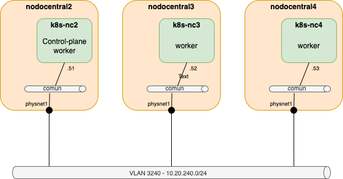

# Cluster de Kubernetes nodo central PAGODA
Este repositorio incluye la información sobre los procedimientos de creación y gestión del cluster de Kubernetes del nodo central de PAGODA, formado por tres nodos desplegados como máquinas virtuales sobre tres de los nodos del cluster OpenStack del nodo central. Las tres máquinas virtuales actuan como nodos que alojan contenedores (workers), actuando la primera máquina virtual, k8s-nc2, como nodo de control del cluster. Cada una de ellas tiene un interfaz en la red virtual de servicios comunes de OpenStack (red común, VLAN 3240), que se comunica con el resto de los equipos conectados a esa VLAN a través del interface physnet1 de los servidores. La conexión de los nodos está implementada como un puerto de OpenStack para que se utilice una dirección IP fija.

En el directorio umu-nc-k8s se pueden encontrar los procedimientos y scripts usados para la creación del cluster k8s.
En el directorio vnx-k8s se puede encontrar el escenario virtual de pruebas del cluster diseñado para la formación en la gestión del cluster y en el despliegue de servicios sobre él. 

