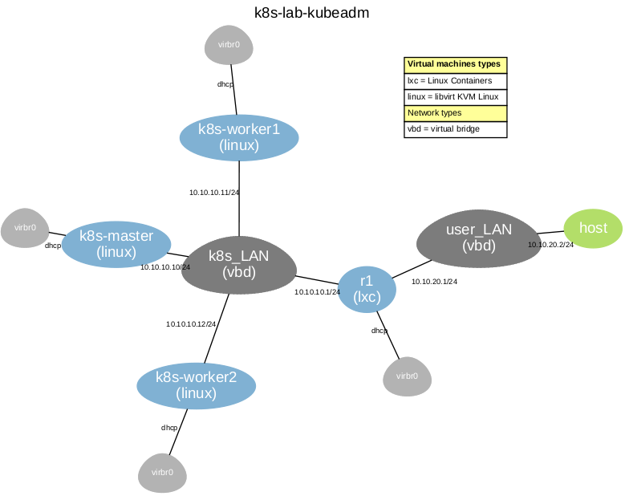

## Escenario de pruebas del cluster de Kubernetes

### Topología del escenario




### Requisitos
#### Host Linux con VNX instalado 
Ver receta de instalación de VNX en http://vnx.dit.upm.es. Receta probada sobre Ubuntu 20.04 y 22.04.

El escenario utiliza dos imágenes de VNX:
- vnx_rootfs_kvm_ubuntu64-22.04-v025.qcow2, usada para las máquinas virtuales KVM que implementan los tres nodos del cluster k8s.
- vnx_rootfs_lxc_ubuntu64-20.04-v025, usada para los contenedores auxiliares del escenario. 

Para descargarlas, ejecutar:
```bash
cd /usr/share/vnx/filesystems
vnx_download_rootfs -r vnx_rootfs_kvm_ubuntu64-22.04-v025.qcow2 -y -l
vnx_download_rootfs -r vnx_rootfs_lxc_ubuntu64-20.04-v025 -y -l
cd -
```
#### kubectl
Para instalar kubectl en el host (ver https://kubernetes.io/docs/tasks/tools/install-kubectl-linux/)
```bash
sudo apt-get update
sudo apt-get install -y ca-certificates curl
sudo curl -fsSLo /etc/apt/keyrings/kubernetes-archive-keyring.gpg https://packages.cloud.google.com/apt/doc/apt-key.gpg
echo "deb [signed-by=/etc/apt/keyrings/kubernetes-archive-keyring.gpg] https://apt.kubernetes.io/ kubernetes-xenial main" | sudo tee /etc/apt/sources.list.d/kubernetes.list
sudo apt-get update
sudo apt-get install -y kubectl
```

### Manual de usuario

- Arranque del escenario:
```bash
sudo vnx -f k8s-lab-kubeadm.xml --create
```
- Instalación del cluster:
```bash
./install-k8s    # Utilizar la opción -p para realizar una pausa entre los distintos pasos de la instalación
```
- Copiar las credenciales del cluster al host para poder acceder al cluster utilizando *kubectl*:
```bash
scp k8s-master:.kube/config ~/.kube
```

### Comprobación del funcionamiento del cluster
- Disponibilidad de nodos del cluster:
```bash
kubectl get nodes
NAME          STATUS   ROLES           AGE   VERSION
k8s-master    Ready    control-plane   15m   v1.26.1
k8s-worker1   Ready    <none>          13m   v1.26.1
k8s-worker2   Ready    <none>          13m   v1.26.1
```
- Estado de los pod del sistema:
```bash
kubectl get pods -n kube-system
NAME                                      READY   STATUS    RESTARTS   AGE
calico-kube-controllers-57b57c56f-dsqfk   1/1     Running   0          35m
calico-node-ddjjh                         1/1     Running   0          35m
calico-node-fzzq9                         1/1     Running   0          35m
calico-node-rvgcd                         1/1     Running   0          35m
coredns-787d4945fb-fvk7c                  1/1     Running   0          37m
coredns-787d4945fb-mssvq                  1/1     Running   0          37m
etcd-k8s-master                           1/1     Running   0          37m
kube-apiserver-k8s-master                 1/1     Running   0          37m
kube-controller-manager-k8s-master        1/1     Running   0          37m
kube-multus-ds-5gd4p                      1/1     Running   0          34m
kube-multus-ds-ch2ns                      1/1     Running   0          34m
kube-multus-ds-whqb5                      1/1     Running   0          34m
kube-proxy-lw54x                          1/1     Running   0          37m
kube-proxy-pvnvd                          1/1     Running   0          35m
kube-proxy-xsskr                          1/1     Running   0          36m
kube-scheduler-k8s-master                 1/1     Running   0          37m
```
- Estado de los pod de Ingress:
```bash
 kubectl get pods -n ingress-nginx
NAME                                        READY   STATUS      RESTARTS   AGE
ingress-nginx-admission-create-2j4f8        0/1     Completed   0          24m
ingress-nginx-admission-patch-shlzz         0/1     Completed   2          24m
ingress-nginx-controller-64f79ddbcc-j8v7n   1/1     Running     0          24m
``` 
-Estado de los pod y configuración de MetalLB:
```bash
kubectl get pods -n metallb-system -o wide
NAME                          READY   STATUS    RESTARTS   AGE   IP                NODE          NOMINATED NODE   READINESS GATES
controller-577b5bdfcc-kl4pg   1/1     Running   0          25m   172.16.194.68     k8s-worker1   <none>           <none>
speaker-9r5hm                 1/1     Running   0          25m   192.168.122.199   k8s-worker2   <none>           <none>
speaker-w95zd                 1/1     Running   0          25m   192.168.122.127   k8s-worker1   <none>           <none>
speaker-xc928                 1/1     Running   0          25m   192.168.122.55    k8s-master    <none>           <none>

kubectl get ipaddresspools.metallb.io -n metallb-system
NAME         AUTO ASSIGN   AVOID BUGGY IPS   ADDRESSES
first-pool   true          false             ["10.10.10.20-10.10.10.30"]

kubectl get l2advertisements.metallb.io -n metallb-system
NAME    IPADDRESSPOOLS   IPADDRESSPOOL SELECTORS   INTERFACES
empty
```

### Ejemplos de despliegue de servicios
Se proporcionan junto con el escenario virtual de pruebas algunos ejemplos sencillo de despliegue de servicios. Los ejemplos se basan en el despliegue de tres servidores web nginx mediante el siguiente *Deployment*:
```bash
apiVersion: apps/v1
kind: Deployment
metadata:
  name: nginx-web-server-pool
spec:
  replicas: 3
  selector:
    matchLabels:
      app: nginx-web-server
  template:
    metadata:
      labels:
        app: nginx-web-server
    spec:
      containers:
        - image: nginx
          name: nginx-web-server
          ports:
            - containerPort: 80
              protocol: TCP
          lifecycle:
            postStart:
              exec:
                command: ["/bin/sh", "-c", "echo $( hostname ) > /usr/share/nginx/html/index.html"]
```
- Para desplegar los tres servidores web: 
```bash
kubectl apply -f examples/nginx-web-server.yaml 
```
- Para comprobar que se han desplegado correctamente: 
```bash
kubectl get pods
NAME                                     READY   STATUS    RESTARTS   AGE
nginx-web-server-pool-6867b54ccc-5r6qv   1/1     Running   0          80m
nginx-web-server-pool-6867b54ccc-fx79w   1/1     Running   0          80m
nginx-web-server-pool-6867b54ccc-k78kp   1/1     Running   0          80m
```

#### Acceso a los servidores mediante un servicio del tipo NodePort
- Definición del servicio (nginx-service-nodeport.yaml):
```bash
apiVersion: v1
kind: Service
metadata:
  name: nginx-service
spec:
  type: NodePort
  ports:
  - port: 9090
    targetPort: 80
    nodePort: 30000
  selector:
    app: nginx-web-server
```
- Despliegue del servicio para acceder a los servidores:
```bash
kubectl apply -f examples/nginx-service-nodeport.yaml
```
- En este caso, el servicio estará accesible en el puerto 30000 de cada una de las direcciones de los nodos. Se puede comprobar el acceso al servicio y el balanceo de tráfico mediante los siguientes comandos:
```bash
while true; do curl --no-progress-meter 10.10.10.10:30000; sleep 1; done    # Acceso a través de nodo k8s-master
while true; do curl --no-progress-meter 10.10.10.11:30000; sleep 1; done    # Acceso a través de nodo k8s-worker1
while true; do curl --no-progress-meter 10.10.10.12:30000; sleep 1; done    # Acceso a través de nodo k8s-worker2
```
#### Acceso a los servidores mediante un servicio del tipo LoadBalancer
- Definición del servicio (nginx-service-lb.yaml):
```bash
apiVersion: v1
kind: Service
metadata:
  name: nginx-service
spec:
  type: LoadBalancer
  ports:
  - port: 9090
    targetPort: 80
  selector:
    app: nginx-web-server
```
- Despliegue del servicio para acceder a los servidores:
```bash
kubectl apply -f examples/nginx-service-lb.yaml
```
- En este caso, el servicio estará accesible en el puerto 9090 de la dirección asignada al servicio nginx-service por el LoadBalancer. Dicha dirección puede averiguarse con el comando:
```bash
kubectl get service
NAME            TYPE           CLUSTER-IP      EXTERNAL-IP   PORT(S)          AGE
kubernetes      ClusterIP      10.96.0.1       <none>        443/TCP          5h2m
nginx-service   LoadBalancer   10.107.39.126   10.10.10.20   9090:30000/TCP   3h
```
- Se puede comprobar el acceso al servicio y el balanceo de tráfico mediante el siguiente comando:
```bash
while true; do curl --no-progress-meter 10.10.10.20:9090; sleep 1; done
```

#### Acceso a los servidores mediante un proxy inverso (Ingress)
- Definición del objeto (nginx-ingress.yaml):
```bash
apiVersion: networking.k8s.io/v1
kind: Ingress
metadata:
  name: nginx-ingress
  annotations:
    kubernetes.io/ingress.class: nginx
    nginx.ingress.kubernetes.io/rewrite-target: /
spec:
  rules:
  - host: example.pagoda.local
    http:
      paths:
      - pathType: Prefix
        path: /path
        backend:
          service:
            name: nginx-service
            port:
              number: 9090
```
- Servicio del tipo ClusterIP asociado: 
```bash
apiVersion: v1
kind: Service
metadata:
  name: nginx-service
spec:
  type: ClusterIP
  ports:
  - port: 9090
    targetPort: 80
  selector:
    app: nginx-web-server
```
- Despliegue del servicio tipo clusterIP al que accederá el objeto ingress:
```bash
kubectl apply -f examples/nginx-service-clusterip.yaml
```
- Despliegue del objeto ingress para acceder a los servidores:
```bash
kubectl apply -f examples/nginx-ingress.yaml
```
- Además, será necesario registrar el dominio example.pagoda.local en el DNS o, alternativamente, en el fichero /etc/hosts del host desde el que se prueba. Se debe asociar a la dirección IP que el MetalLB asigna al ingress. Dicha dirección se puede averiguar con el comando:
```bash
kubectl get services -n ingress-nginx ingress-nginx-controller
```
- Directamente se puede averiguar la dirección y añadir al /etc/hosts con:
```bash
NGINXIPADDR=$( kubectl get services -n ingress-nginx ingress-nginx-controller -o jsonpath='{.status.loadBalancer.ingress[0].ip}' )
sudo bash -c "echo '$NGINXIPADDR example.pagoda.local' >> /etc/hosts" 
```
- Se puede comprobar el acceso al servicio y el balanceo de tráfico mediante el siguiente comando:
```bash
while true; do curl --no-progress-meter example.pagoda.local/path; sleep 1; done
```

### Referencias
- How to Install Kubernetes Cluster on Ubuntu 22.04. https://www.linuxtechi.com/install-kubernetes-on-ubuntu-22-04/
- Exposing Kubernetes services with MetalLB and Nginx ingress controller. https://sangvhh.net/exposing-kubernetes-services-with-metallb-and-nginx-ingress-controller/

